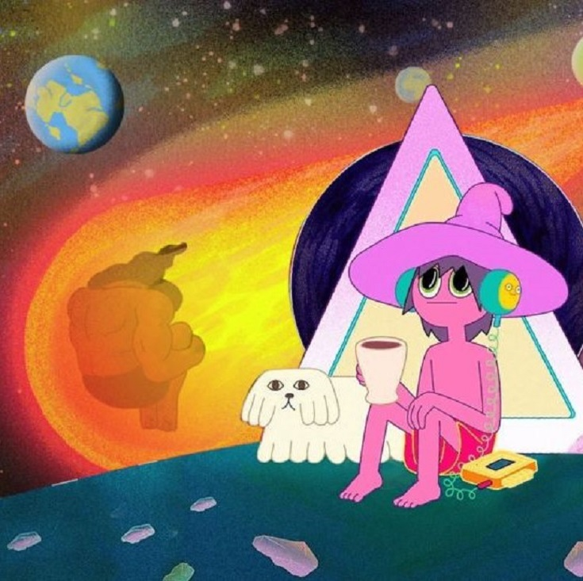

<!DCOTYPE html>
<html lang="es">
<head>	
    
    <title>Midnight_Gosspel</title>
    <link rel="stylesheet" href="style.css">
</head>
<body> 
<header id="main-header">

        <a id="logo-header">

 Midnight Gosspel 
</a><!--/#logo-header-->
<nav>
	<ul>
		<li><a href="creadores.html">Creadores</a></li>
		<li><a href="trama.html">Trama</a></li>
	</ul>
	</nav><!-- / nav -->

</header><!-- / #main-header-->

<section id="main-content">
<article>

The Midnight Gospel es una serie de televisión estadounidense 
de animación para adultos creada por Pendleton Ward y el comediante Duncan Trussell. 
Es la primera producción animada de Ward para Netflix.
La serie sigue al spacecaster Clancy, que posee un simulador de multiversos. 
Mediante este, él viaja a través de mundos a punto de sufrir sus propios apocalipsis,
con el objetivo de entrevistar a sus habitantes para su spacecast, y así mejorar espiritualmente.

fue producida por la empresa Titmouse inc lanzada por Netflix el 20 de abril de 2020
la empresa Titmouse inc es un estudio de animación estadounidense que desarrolla y produce programación de television animada,
largometrajes, videos musicales, secuencias de titulos, comerciales y cortometrajes  
Algunas de sus producciones incluyen Breadwinners para Nickelodeon, T.O.T.S. para Disney, Motorcity para 
Disney XD, Big Mouthy The Midnight Gospel para Netflix, Metalocalypse, 
Los hermanos Venture y Black Dynamite para Adult Swim,y Megas XLR y Mao Mao: Heroes of Pure Heart
para Cartoon Network.

